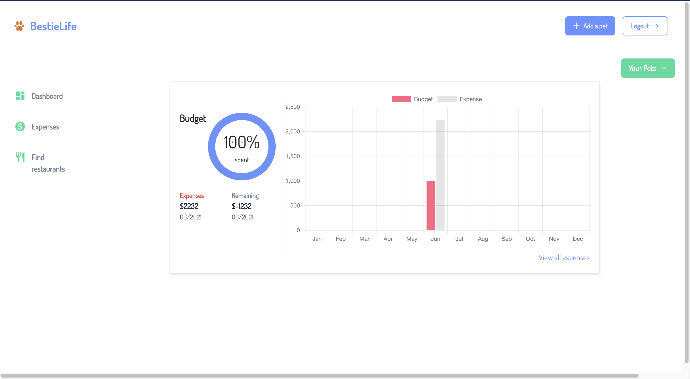

<p align="center"></p>
<h1 align="center">BestieLife</h1>

<h4 align="center">An application to manage your pet's life efficiently.</h4>
<br />

<p align="center">
  <a href="#proposed-features">Proposed Features</a> •
  <a href="#tech-stack">Tech Stack</a> •
  <a href="#how-to-use">How To Use</a> •
  <a href="#database-design">Database Design</a> •
  <a href="#credits">Credits</a> •
  <a href="#related">Related</a> •
  <a href="#license">License</a>
</p>
<br />

Login screen               |  Dashboard                |  Expenses
:-------------------------:|:-------------------------:|:-------------------------:
  |    |  

<br />

## Tech Stack

* ReactJS/Typescript
* Chakra UI
* Node
* TypeORM
* PostgreSQL
* Apollo Client/Server

<br />

## Proposed Features

* Cookie-based authentication.
* Expense and budget tracking
* Explore pet-friendly restaurants/cafe  

## How To Use

To clone and run this application, you'll need [Git](https://git-scm.com) and [Node.js](https://nodejs.org/en/download/) (which comes with [npm](http://npmjs.com)) installed on your computer. From your command line:

```bash
# Clone this repository
$ git clone https://github.com/appu4ever/bestielife-fullstack

# Go into the client repository
$ cd bestielife-fullstack/client

# Install dependencies
$ yarn install

# Run the app
$ yarn run dev

# Go into the server repository
$ cd bestielife-fullstack/server

# Install dependencies
$ yarn install

# Run the app
$ yarn run dev

```

<br />

## Database Design


